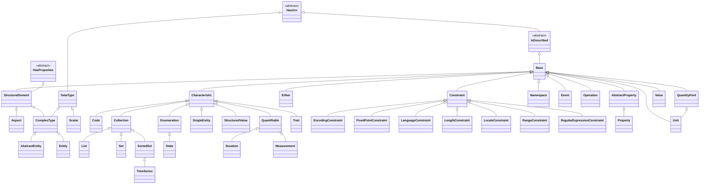

# Base
This folder contains a minimum definition of the elements in the SAMM. The folder does not include any implementations. 
It can be seen as a contract that establishes a fixed structure and inheritance hierarchy.
The classes should not be instantiated because they are abstract which is similar to interfaces in Java.

# Inheritance hierarchy

The diagram below shows the inheritance hierarchy of the base (interface) classes. `HasUrn`,
`IsDescribed` and `HasProperties` are abstract base classes; `StructureElement` and `ComplexType`
use multiple inheritance.

> Note: `BoundDefinition` is a standalone `enum.Enum` (the upper/lower boundary rule for a
> `RangeConstraint`) and is therefore not part of the class hierarchy above.
